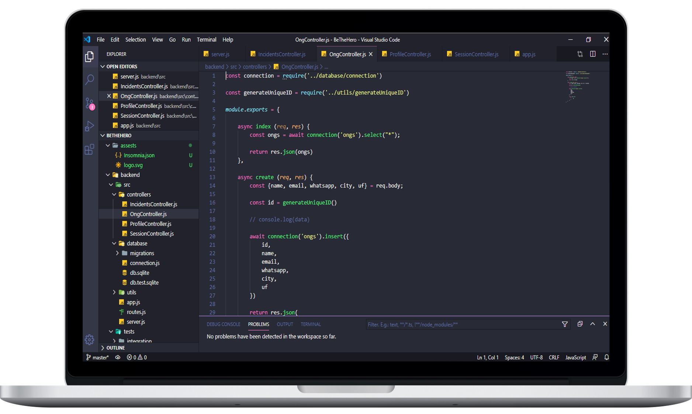

<h1 align="center">
    
</h1>

<p align="center">
<a aria-label="Versão do Node" href="https://github.com/nodejs/node/blob/master/doc/changelogs/CHANGELOG_V12.md#12.14.1">
    </img>
  </a>
  <a aria-label="Versão do React" href="https://github.com/facebook/react/blob/master/CHANGELOG.md#16120-november-14-2019">
    </img>
  </a>
  <a aria-label="Versão do Expo" href="https://www.npmjs.com/package/expo-cli/v/3.11.5">
    </img>
  </a>
  <a aria-label="Completo" href="https://rocketseat.com.br/week/aulas/11.0?aula=5">
    </img>
  </a>
  <br>
  

  
  
  <a href="https://github.com/gustavosdepaula/BeTheHero/commits/master">
    
  </a>

  <a href="https://github.com/gustavosdepaula/BeTheHero/issues">
    
  </a>

  
</p>

<p align="center">
  <a href="#-tecnologias">🚀 Tecnologias</a>&nbsp;&nbsp;&nbsp;|&nbsp;&nbsp;&nbsp;
  <a href="#%EF%B8%8F-projeto">🖥️ Projeto</a>&nbsp;&nbsp;&nbsp;|&nbsp;&nbsp;&nbsp;
  <a href="#-backend">🔨 Backend</a>&nbsp;&nbsp;&nbsp;|&nbsp;&nbsp;&nbsp;
  <a href="#-frontend">🌐 Frontend</a>&nbsp;&nbsp;&nbsp;|&nbsp;&nbsp;&nbsp;
  <a href="#-mobile">📱 Mobile</a>&nbsp;&nbsp;&nbsp;
  <br>
  <a href="#%EF%B8%8F-demonstração">☁️ Demonstração</a>&nbsp;&nbsp;&nbsp;|&nbsp;&nbsp;&nbsp;
  <a href="#-como-executar">⚙️ Como executar</a>&nbsp;&nbsp;&nbsp;
  <br>
  <a href="#-como-contribuir">😉 Como contribuir</a>&nbsp;&nbsp;&nbsp;|&nbsp;&nbsp;&nbsp;
   <a href="#-licença">🧾 Licença</a>&nbsp;&nbsp;&nbsp;|&nbsp;&nbsp;&nbsp;
    <a href="#-Autor">🧑 Autor</a>
</p>


<h1>

## 🚀 Tecnologias

Esse projeto foi desenvolvido com as seguintes tecnologias:

- [Node.js](https://nodejs.org/en/)
- [React](https://reactjs.org)
- [React Native](https://facebook.github.io/react-native/)
- [Expo](https://expo.io/)
- [Celebrate](https://github.com/arb/celebrate)
- [Jest](https://jestjs.io/)

## 🖥️ Projeto
O Projeto Be The Hero tem como objetivo conectar pessoas com vontade de ajudar com as ONGS/pessoa que tenham vontade de ser ajudados, para receber a ajuda é necessário um cadastro nominal e também fazer o cadastro de caso na aplicação web para ajudar é necessário baixar a versão mobile vendo assim os casos de todas a ongs e ajudando essas ONGS/pessoas de forma monetária.
## 🔨 Backend

<h2 align="center">
  <a href="https://github.com/gustavosdePaula/BeTheHero/tree/master/backend" target="_blank"></a>
</h2>

<h1 align="center">
<a href="./assets/Insomnia.json" target="_blank"></a>
</h1>

## 🌐 Frontend
<h1 align="center">
<a href="https://github.com/gustavosdePaula/BeTheHero/tree/master/frontend" target="_blank">
    </a>
</h1>

## 📱 Mobile
<h2 align="center">
  <a href="https://github.com/gustavosdePaula/BeTheHero/tree/master/mobile" target="_blank"></a>
</h2>

## ☁️ Demonstração

- [Netlify](https://bethehero-1.netlify.com/)
- [Heroku](https://backend-bethehero-gsp.herokuapp.com)


## ⚙️ Como Executar

#### Clonando o projeto
```sh
git clone https://github.com/gustavosdepaula/BeTheHero.git
cd BeTheHero

```
#### Iniciando Backend
```sh
cd backend
yarn
yarn start
```
#### Iniciando Frontend
```sh
cd frontend
yarn
yarn start
```
#### Iniciando mobile
```sh
cd mobile
yarn
yarn start
```

## 😉 Como contribuir

- Faça um fork desse repositório;
- Cria uma branch com a sua feature: `git checkout -b minha-feature`;
- Faça commit das suas alterações: `git commit -m 'feat: Minha nova feature'`;
- Faça push para a sua branch: `git push origin minha-feature`.

Depois que o merge da sua pull request for feito, você pode deletar a sua branch.


## 🧾 Licença

Esse projeto está sob a licença MIT. Veja o arquivo [LICENSE](LICENSE.md) para mais detalhes.

---
## 🧑 Autor

[<br><sub>@gustavosdepaula</sub>](https://github.com/gustavosdepaula) 

<p align="center">Made with 💗 by Gustavo S. de Paula</p>

